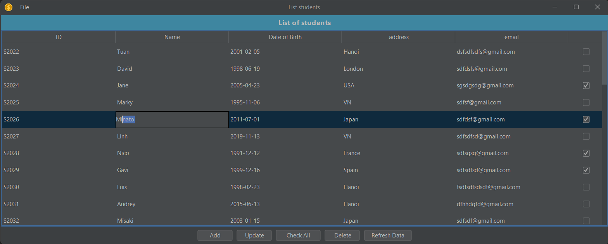

# Course Management Program - Desktop App

Author: Phan Quang Tuan

This Java Swing UI application serves as a basic course administration system. The purpose of this program is to allow
the students of a faculty of a university to enroll into pre-defined course modules each semester, and to allow the
administrative staff of the faculty to enter the module marks for each enrolment and to compute the final grade from
these marks.

The System has 3 entities: Student, Module and Enrollment. Full requirement details (before I expanded advanced
features) can be accessed from here:
https://drive.google.com/drive/folders/12ZbHg7MRTInRFU9tkUYIPtQkLRQFvbmo?usp=share_link

## What's new
V1.1 is released!

Read the file `ChangeLog.txt` for details.

## How to use

Open the project then run the file `CourseManProg.java`.

This program <strong>requires</strong> the pre-defined database that has been placed in the same folder with this readme
file. Make sure the database file named `database.sqlite3` is in the default path.

Moreover, When running the program, make sure check-box is ticked before use Add/Update/Delete button.

Note 1: <strong>Requires</strong> jdk >= 11

Note 2: This program requires SQLite JDBC driver. Make sure your project has been added with it before run. 

Note 3: Due to Java Swing's drawbacks, sometimes you need to press enter in text field before clicking Add/Update/Delete
button to avoid unconfirmed text field data loss.

### Technologies & patterns that have been used:

- Java Swing API
- MVC Pattern
- <strong>Repository pattern for JDBC</strong>
- Data Access Object (DAO) Pattern for JDBC
- Batch Processing in JDBC
- SQLite database version 3
- Data Transfer Objects (DTO) Pattern
- Java Stream API
- Java Lambda Expressions
- Multi threading
- Java Reflection API (Meta programming)
- Factory pattern & Singleton pattern

### Advanced features

- Live input validation (when adding new Enrollment).
- Editing Student or Module or Enrollment in JTable while keeping the data being persistent and maintain data integrity.
- Generating unique Student's id & Module's code in the correct order.
- Properly generate the new Module's code even if the user deleted the Module with that code before.

### Theory implemented in this program:

<strong>The SOLID principles</strong>, which is an acronym for five principles that go beyond the fundamental OOP ideas.

The SOLID acronym represents the following:

- Single responsibility principle
- Open/Closed principle
- Liskov substitution principle
- Interface segregation principle
- Dependency inversion principle

### Look and Feel

This program uses the FlatLaf, a modern open-source cross-platform Look and Feel for Java Swing desktop applications.

The FlatLaf homepage and source code:  
https://www.formdev.com/flatlaf/  
https://github.com/JFormDesigner/FlatLaf

Many thanks to DevCharly, the author of FlatLaf.

### License

This program is released under the MIT License.

### Some screenshots

